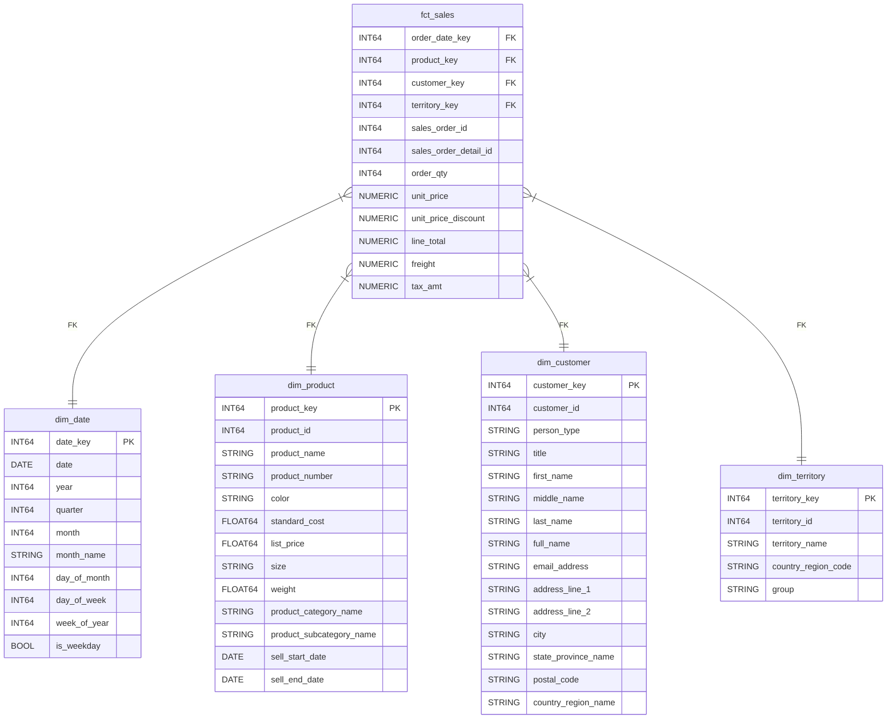

```mermaid
erDiagram
    dim_date {
        INT64 date_key PK
        DATE date
        INT64 year
        INT64 quarter
        INT64 month
        STRING month_name
        INT64 day_of_month
        INT64 day_of_week
        INT64 week_of_year
        BOOL is_weekday
    }

    dim_product {
        INT64 product_key PK
        INT64 product_id
        STRING product_name
        STRING product_number
        STRING color
        FLOAT64 standard_cost
        FLOAT64 list_price
        STRING size
        FLOAT64 weight
        STRING product_category_name
        STRING product_subcategory_name
        DATE sell_start_date
        DATE sell_end_date
    }

    dim_customer {
        INT64 customer_key PK
        INT64 customer_id
        STRING person_type
        STRING title
        STRING first_name
        STRING middle_name
        STRING last_name
        STRING full_name
        STRING email_address
        STRING address_line_1
        STRING address_line_2
        STRING city
        STRING state_province_name
        STRING postal_code
        STRING country_region_name
    }

    dim_territory {
        INT64 territory_key PK
        INT64 territory_id
        STRING territory_name
        STRING country_region_code
        STRING group
    }

    fct_sales {
        INT64 order_date_key FK
        INT64 product_key FK
        INT64 customer_key FK
        INT64 territory_key FK
        INT64 sales_order_id
        INT64 sales_order_detail_id
        INT64 order_qty
        NUMERIC unit_price
        NUMERIC unit_price_discount
        NUMERIC line_total
        NUMERIC freight
        NUMERIC tax_amt
    }

    fct_sales }|--|| dim_date : "FK"
    fct_sales }|--|| dim_product : "FK"
    fct_sales }|--|| dim_customer : "FK"
    fct_sales }|--|| dim_territory : "FK"
```